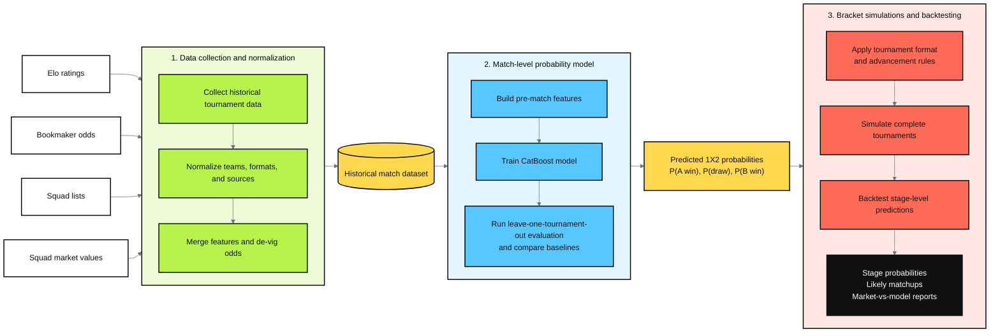

# WorldCup2026 Bracket

`WorldCup2026 Bracket` is a three-stage pipeline for collecting international tournament data, training a match-level 1X2 probability model, and backtesting full tournament bracket simulations.

The project asks whether a small set of public pre-match signals can recover bookmaker-style match probabilities and still remain useful once those probabilities are pushed through full tournament brackets. In practice, the repo tests how far Elo, squad market values, confederation membership, and de-vigged bookmaker consensus can take the pipeline from historical data collection to bracket-level backtests.

## Pipeline

1. `Data_Collection`
   Collects and normalizes historical inputs such as Elo fixtures, bookmaker odds, squad lists, and squad market values.
2. `Match_model`
   Builds the historical match dataset and runs leave-one-tournament-out evaluation for the CatBoost match model and baseline methods.
3. `Bracket_Simulations`
   Simulates full World Cup brackets under market-derived and model-derived probabilities, then evaluates stage-level predictions against the historical outcomes.

## Repository layout

- `Data_Collection/`: collectors, manifests, tests, and committed partition outputs.
- `Match_model/`: dataset build, model evaluation, committed experiment outputs, and report.
- `Bracket_Simulations/`: simulation engine, committed backtest summaries, and compare outputs.

## Results at a glance

The backtests indicate that a compact CatBoost model built from public pre-match signals can provide a useful foundation for full-tournament simulations.

At the match level, the model consistently outperforms the Elo baseline under leave-one-tournament-out evaluation. The improvement is visible across historical tournaments and remains strong on the WC2026 out-of-sample holdout. At the bracket level, the model is competitive with the market-derived baseline and often improves the simulation fit, especially for later-stage outcomes.

### Match-level probability estimates

The CatBoost model produces substantially lower held-out Brier scores than the Elo baseline in both match phases:

A note on the baseline: Elo is primarily a team-strength rating. It is conceptually related to the FIFA world ranking, which also uses an Elo-style update procedure, although the two systems are not identical. Elo provides a strong and interpretable signal of relative team strength, but using it alone as a match-probability estimator is intentionally simple: it cannot fully capture factors such as squad composition, recent trends, tournament stage, or other match-specific conditions. The improvement below should therefore be interpreted as the value of combining a richer feature set with a more flexible probability model, rather than as evidence that Elo is a weak rating system. For the bracket backtests, the more demanding benchmark is the market-derived baseline.

The improvement is not driven by a single tournament. CatBoost achieves a lower Brier score than Elo in every historical leave-one-tournament-out fold shown below, with reductions ranging from **41% to 71%**. On the WC2026 holdout, the model records a **70% lower** Brier score than Elo.

Because the WC2026 holdout Brier score sits near the lower end of the historical range and the model's error is substantially lower for knockout-stage matches, I consider its probability estimates reliable enough to use as the foundation for the bracket simulations.

#### What the error looks like in practice

Brier score and cross-entropy are useful for comparing models but are hard to interpret directly. The headline figure is the weighted MAE: for each match, take the absolute difference between the model's probability and the de-vigged market consensus separately for home win, draw, and away win, then average across the three outcomes.

For the full leave-one-tournament-out evaluation the weighted MAE is **3.86 pp** per outcome on average. The table below applies that figure to a representative 1X2 line with a clear home favourite:

| Outcome | Market | Model | Δ pp |
|---------|--------|-------|------|
| Home win | 70.0% | 64.2% | −5.8 |
| Draw | 20.0% | 22.9% | +2.9 |
| Away win | 10.0% | 12.9% | +2.9 |
| **Macro MAE** | | | **3.87 pp** |

On the WC2026 out-of-sample holdout the figure is **3.68 pp**, placing the tournament comfortably within the historical range. The example below uses a representative group-stage line with a moderate favourite:

| Outcome | Market | Model | Δ pp |
|---------|--------|-------|------|
| Home win | 58.0% | 52.5% | −5.5 |
| Draw | 26.0% | 28.8% | +2.8 |
| Away win | 16.0% | 18.7% | +2.7 |
| **Macro MAE** | | | **3.67 pp** |

The error is not uniform across match types. Group-stage matches average **4.17 pp** while knockout matches average **2.99 pp** - consistent with the Brier chart above. Later-stage knockout matches involve stronger and more symmetrically rated teams where market and model signals converge.

#### Accuracy against actual match outcomes

The evaluation above scores predictions against the de-vigged market consensus, measuring how closely the model tracks market pricing. When scored instead against the 90-minute result, the market wins roughly **55% of per-game log-loss comparisons** across 556 held-out matches. The model trails on mean log-loss but leads on **top-1 correct picks** (54.1% vs 53.4%), getting 4 extra correct calls across 256 World Cup matches. When model and market pick different favourites (37 games), they split even on log-loss but the model wins 14 vs 10 on top-1.

This is the expected result rather than a failure: the model is trained to approximate market soft labels, so the market will always edge ahead when both are scored on the same hard-outcome measure. Log-loss also penalises confident wrong calls heavily - the model can simultaneously win more correct picks and lose mean log-loss if it assigns too much mass to those picks when they are wrong. Crucially, this does not undermine the bracket results. Bracket simulation chains many matches, and the probability shifts that cost the model on per-game log-loss can compound across a full tournament in ways that improve stage-level coverage. 

### Bracket-level backtesting

The full-bracket simulations are evaluated against the actual outcomes of the 2010–2022 World Cups. Three complementary metrics capture different dimensions of bracket quality.

**Top-N recall** - for each stage, does the simulation rank the teams that actually advanced among its highest-probability picks? A simulation that assigns high marginal probability to a team that genuinely reached, say, the semi-finals scores well here. Higher is better.

**Qualifier Brier** - for teams that actually reached a given stage, how confident was the simulation that they would? This measures calibration against actual outcomes: lower Brier means the simulation assigned higher probability to the teams that genuinely advanced.

**All-teams-seen cumulative coverage** - how far down the ranked list of bracket scenarios must you go before every team that actually advanced has appeared in at least one simulated combo? Lower means the actual outcomes were concentrated near the top of the probability distribution.

**Recall: model leads at every stage**

The model improves average Top-N recall at every stage of the bracket:

**Qualifier Brier: market leads at every stage**

The market-derived baseline has lower qualifier Brier at every stage, meaning it assigned slightly higher probability to the teams that actually advanced. Because qualifier Brier is defined as the mean squared error of `(predicted probability − 1)` over qualifying teams, the implied average probability a team was given for reaching each stage is simply `1 − √Brier`. Translating the chart into those terms:

| Stage | Market avg probability for actual qualifiers | Model avg probability | Gap |
|-------|----------------------------------------------|-----------------------|-----|
| R16 | 55.8% | 54.8% | 1.0 pp |
| QF | 43.0% | 39.9% | 3.1 pp |
| SF | 28.3% | 25.2% | 3.1 pp |
| Final | 19.4% | 17.7% | 1.7 pp |
| Winner | 12.3% | 11.3% | 1.0 pp |

The gap between the market and the model is only 1-3 percentage points, depending on the stage, so the absolute improvement is modest. The more important pattern is the rising curve shared by both: even the eventual champion was assigned only around a 12% chance of winning the tournament by the market. This reflects the inherent uncertainty of knockout football, where a few upsets can reshape the entire bracket. That uncertainty is even more relevant for the 2026 World Cup, which expands to 48 teams and introduces an additional round of knockout matches.

**Cumulative coverage: model leads where it matters most**

The market edges ahead at early stages (R16 and QF), but the model pulls clearly ahead at the stages that matter most, cutting the error by **16.3 pp at the Final** and **13.5 pp at the Winner** stage:

Taken together: the market calibrates slightly better on the teams that advance (lower qualifier Brier), but the model concentrates more probability mass on the scenarios that actually happen (better recall and cumulative coverage at late stages). For bracket prediction - where correctly identifying the likely finalists and winner matters most - the model's late-stage advantage is the more relevant result.

## Quick start

Requires Python 3.10+.

Each pipeline stage is self-contained and has its own `README.md` with setup instructions, prerequisites, and the exact commands to run:

- [`Data_Collection/README.md`](Data_Collection/README.md) - collect and normalize tournament inputs
- [`Match_model/README.md`](Match_model/README.md) - build the match dataset and run model evaluation
- [`Bracket_Simulations/README.md`](Bracket_Simulations/README.md) - simulate brackets and run backtests

Run the stages in order.

## Sources and references

- World Football Elo Ratings: https://eloratings.net/
- OddsPortal football odds archive: https://www.oddsportal.com/football/
- Wikipedia tournament squad pages: https://en.wikipedia.org/wiki/2026_FIFA_World_Cup_squads
- Transfermarkt: https://www.transfermarkt.com/

These are the main external data sources behind the committed inputs. Stage-level READMEs describe how each source is used inside the pipeline.

## License

This repository is released under the MIT License. See [LICENSE](LICENSE).

Third-party data, trademarks, and external media are not covered by the MIT License and remain the property of their respective owners.
