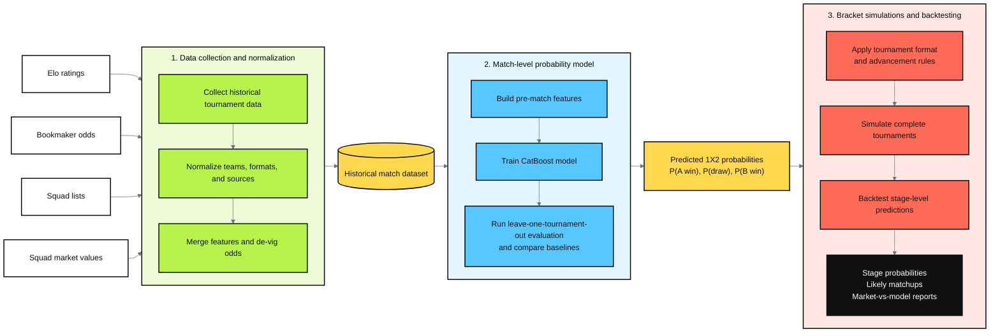

# WorldCup2026 Bracket

`WorldCup2026 Bracket` is a three-stage pipeline for collecting international tournament data, training a match-level 1X2 probability model, and backtesting full tournament bracket simulations.

The project asks whether a small set of public pre-match signals can recover bookmaker-style match probabilities and still remain useful once those probabilities are pushed through full tournament brackets. In practice, the repo tests how far Elo, squad market values, confederation membership, and de-vigged bookmaker consensus can take the pipeline from historical data collection to bracket-level backtests.

## Pipeline

1. `Data_Collection`
   Collects and normalizes historical inputs such as Elo fixtures, bookmaker odds, squad lists, and squad market values.
2. `Match_model`
   Builds the historical match dataset and runs leave-one-tournament-out evaluation for the CatBoost match model and baseline methods.
3. `Bracket_Simulations`
   Simulates full World Cup brackets under market-derived and model-derived probabilities, then evaluates stage-level predictions against the historical outcomes.

## Repository layout

- `Data_Collection/`: collectors, manifests, tests, and committed partition outputs.
- `Match_model/`: dataset build, model evaluation, committed experiment outputs, and report.
- `Bracket_Simulations/`: simulation engine, committed backtest summaries, and compare outputs.

## Quick start

Requires Python 3.10+.

Each pipeline stage is self-contained and has its own `README.md` with setup instructions, prerequisites, and the exact commands to run:

- [`Data_Collection/README.md`](Data_Collection/README.md) — collect and normalize tournament inputs
- [`Match_model/README.md`](Match_model/README.md) — build the match dataset and run model evaluation
- [`Bracket_Simulations/README.md`](Bracket_Simulations/README.md) — simulate brackets and run backtests

Run the stages in order.

## Sources and references

- World Football Elo Ratings: https://eloratings.net/
- OddsPortal football odds archive: https://www.oddsportal.com/football/
- Wikipedia tournament squad pages: https://en.wikipedia.org/wiki/2026_FIFA_World_Cup_squads
- Transfermarkt: https://www.transfermarkt.com/

These are the main external data sources behind the committed inputs. Stage-level READMEs describe how each source is used inside the pipeline.

## License

This repository is released under the MIT License. See [LICENSE](LICENSE).

Third-party data, trademarks, and external media are not covered by the MIT License and remain the property of their respective owners.
