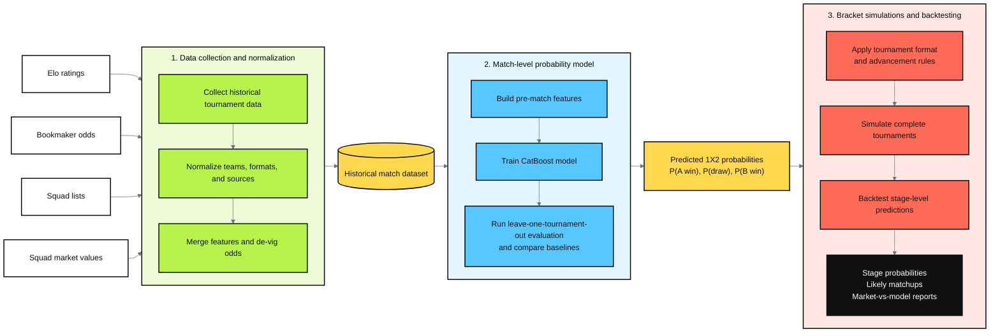
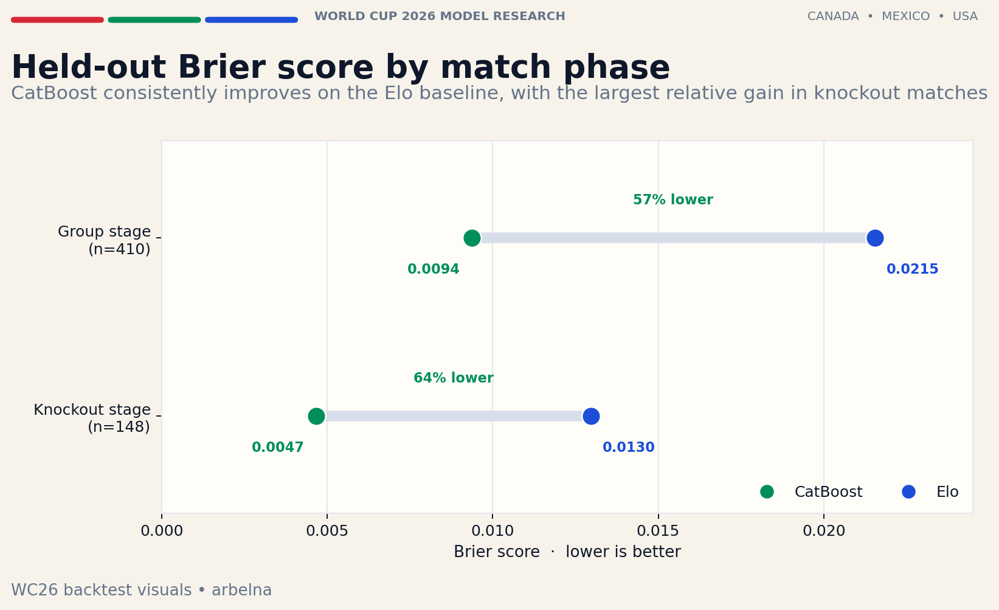
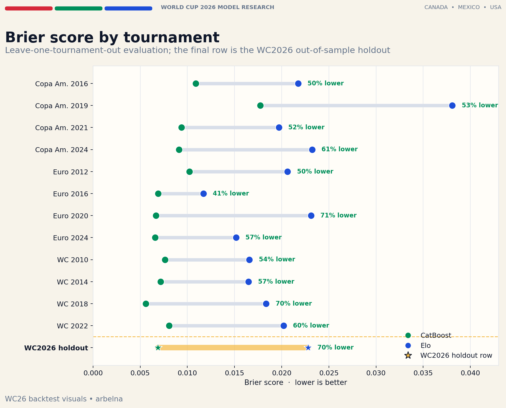
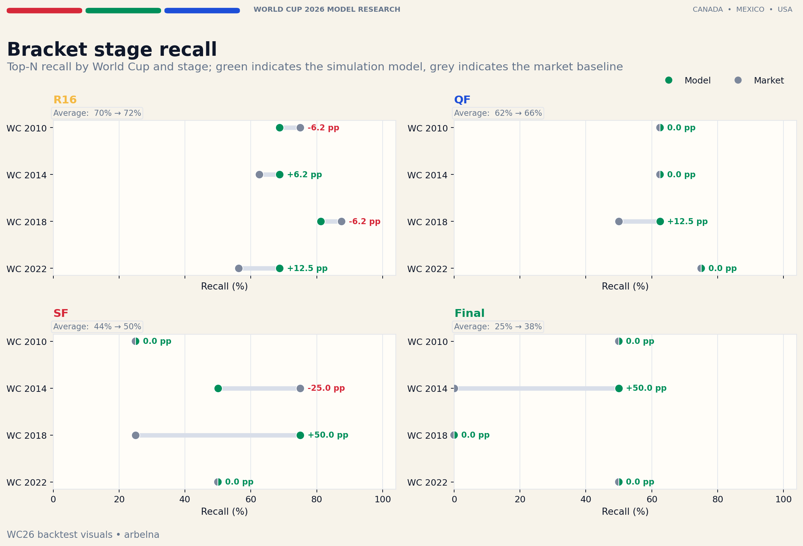
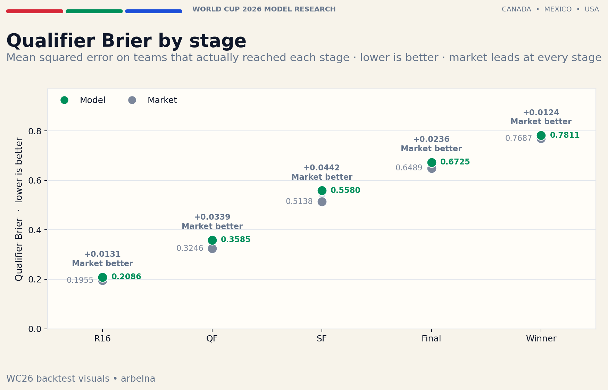
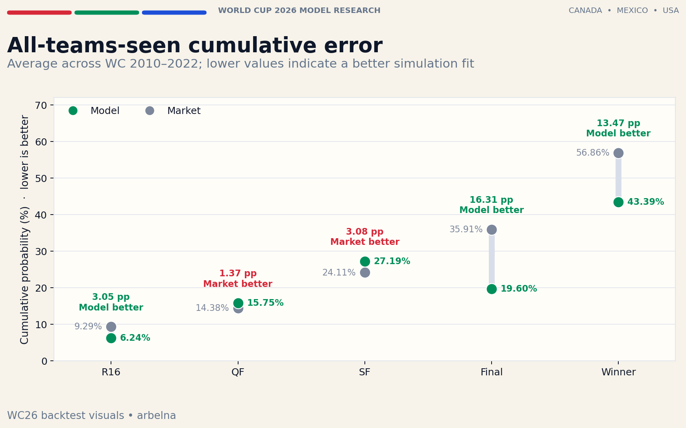

# WorldCup2026 Bracket

`WorldCup2026 Bracket` is a three-stage pipeline for collecting international tournament data, training a match-level 1X2 probability model, and backtesting full tournament bracket simulations.

The project asks whether a small set of public tournament-start signals can recover bookmaker-style match probabilities and still remain useful once those probabilities are pushed through full tournament brackets. In practice, the repo tests how far tournament-start Elo, squad market values, confederation membership, and de-vigged bookmaker consensus can take the pipeline from historical data collection to bracket-level backtests.

## Pipeline

1. `Data_Collection`
   Collects and normalizes historical inputs such as Elo fixtures, bookmaker odds, squad lists, and squad market values.
2. `Match_model`
   Builds the historical match dataset and runs leave-one-tournament-out evaluation for the CatBoost match model and baseline methods.
3. `Bracket_Simulations`
   Simulates full World Cup brackets under market-derived and model-derived probabilities, then evaluates stage-level predictions against the historical outcomes.

## Repository layout

- `Data_Collection/`: collectors, manifests, tests, and committed partition outputs.
- `Match_model/`: dataset build, model evaluation, committed experiment outputs, and report.
- `Bracket_Simulations/`: simulation engine, committed backtest summaries, and compare outputs.

## Results at a glance

The backtests indicate that a compact CatBoost model built from public tournament-start signals can provide a useful foundation for full-tournament simulations.

At the match level, the model consistently outperforms the Elo baseline under leave-one-tournament-out evaluation. The improvement is visible across historical tournaments and remains strong on the WC2026 out-of-sample holdout. At the bracket level, the model is **competitive** with the market-derived baseline. The goal is not to beat the market, which aggregates far more information, but to track it closely enough to be a reliable simulation foundation. The market is better calibrated for mid-range favourites (0.5-0.7 probability range), but this gap is concentrated at the group and R16 stages; from the quarter-finals onward it has negligible practical impact on bracket outcomes.

### Match-level probability estimates

The CatBoost model produces substantially lower held-out Brier scores than the Elo baseline in both match phases:

A note on the baseline: Elo is primarily a team-strength rating. It is conceptually related to the FIFA world ranking, which also uses an Elo-style update procedure, although the two systems are not identical. This repo now uses the tournament-start Elo snapshot as the rating source of truth for every tournament, including the historical backtests, so the match model and bracket simulator read the same rating surface. Elo provides a strong and interpretable signal of relative team strength, but using it alone as a match-probability estimator is intentionally simple: it cannot fully capture factors such as squad composition, recent trends, tournament stage, or other match-specific conditions. The improvement below should therefore be interpreted as the value of combining a richer feature set with a more flexible probability model, rather than as evidence that Elo is a weak rating system. For the bracket backtests, the more demanding benchmark is the market-derived baseline.

The improvement is not driven by a single tournament. CatBoost achieves a lower Brier score than Elo in every historical leave-one-tournament-out fold shown below, with reductions ranging from **33% to 66%**. On the WC2026 holdout, the model records a **72% lower** Brier score than Elo.

Because the WC2026 holdout Brier score (0.0065) is the best result across all 12 historical LOTO folds - below the historical range of 0.0071-0.0201 - and the model's error on knockout matches (Brier 0.0069) is lower than on group-stage matches (0.0107), I consider its probability estimates reliable enough to use as the foundation for the bracket simulations. Since the bracket consists mostly of knockout matches, the effective per-match error feeding into the simulations is even lower than the holdout headline.

#### What the error looks like in practice

Brier score and cross-entropy are useful for comparing models but are hard to interpret directly. The headline figure is the weighted MAE: for each match, take the absolute difference between the model's probability and the de-vigged market consensus separately for home win, draw, and away win, then average across the three outcomes.

For the full leave-one-tournament-out evaluation the weighted MAE is **4.17 pp** per outcome on average. The table below applies that figure to a representative 1X2 line with a clear home favourite:

| Outcome | Market | Model | Delta pp |
|---------|--------|-------|----------|
| Home win | 70.0% | 63.7% | -6.3 |
| Draw | 20.0% | 23.1% | +3.1 |
| Away win | 10.0% | 13.2% | +3.2 |
| **Macro MAE** | | | **4.20 pp** |

On the WC2026 out-of-sample holdout the figure is **3.56 pp**, placing the tournament comfortably within the historical range. The example below uses a representative group-stage line with a moderate favourite:

| Outcome | Market | Model | Delta pp |
|---------|--------|-------|----------|
| Home win | 58.0% | 52.7% | -5.3 |
| Draw | 26.0% | 28.7% | +2.7 |
| Away win | 16.0% | 18.6% | +2.6 |
| **Macro MAE** | | | **3.53 pp** |

The error is not uniform across match types. Group-stage matches average **4.40 pp** while knockout matches average **3.55 pp** - consistent with the Brier chart above. Later-stage knockout matches involve stronger and more symmetrically rated teams where market and model signals converge.

#### Accuracy against actual match outcomes

The evaluation above scores predictions against the de-vigged market consensus, measuring how closely the model tracks market pricing. When scored instead against the 90-minute result, the market wins roughly **55% of per-game log-loss comparisons** across 558 held-out matches. The model trails on mean log-loss but leads on **top-1 correct picks** (54.1% vs 53.4%), getting 4 extra correct calls across 256 World Cup matches. When model and market pick different favourites on World Cup matches (13 games), the model leads 9 vs 4 on log-loss wins and 6 vs 2 on top-1.

| Metric | Market | Model |
|--------|--------|-------|
| Log-loss wins - all matches (558) | **305 - 54.7%** | 253 - 45.3% |
| Top-1 correct - all matches (558) | 298 - 53.4% | **302 - 54.1%** |
| Top-1 correct - World Cups only (256) | 133 - 52.0% | **137 - 53.5%** |
| Top-1 when favourites differ - World Cups (13 games) | 2 | **6** |

This is the expected result rather than a failure: the model is trained to approximate market soft labels, so the market will always edge ahead when both are scored on the same hard-outcome measure. Log-loss also penalises confident wrong calls heavily - the model can simultaneously win more correct picks and lose mean log-loss if it assigns too much mass to those picks when they are wrong. Crucially, this does not undermine the bracket results. Bracket simulation chains many matches, and the probability shifts that cost the model on per-game log-loss can compound across a full tournament in ways that improve stage-level coverage. On the metrics that matter for bracket prediction - recall and cumulative coverage at the Final and Winner stages - the model leads the market. Full analysis in [`Match_model/results.md`](Match_model/results.md).

### Bracket-level backtesting

The bracket stage is now context-aware at pairwise generation time. Group-stage probabilities are built from the real scheduled fixtures with `stage_binary=1.0` and venue-derived host advantage, while knockout probabilities are generated separately by stage and slot with `stage_binary=0.0` and host context supplied from committed slot maps. This means the same team pairing can legitimately receive different probabilities in group and knockout contexts.

> **A note on comparison fairness.** `market_all` uses historical bookmaker odds set per-match during each tournament. For knockout matches, those odds incorporated group-stage results, injuries, and in-tournament momentum - information that was not available at tournament start. `model_all` uses only pre-tournament features (Elo, squad values, confederation) for every match. The model therefore operates under an informational disadvantage in this comparison, and its broadly competitive performance should be read in that context.

The full-bracket simulations are evaluated against the actual outcomes of the 2010-2022 World Cups. Three complementary metrics capture different dimensions of bracket quality.

**Top-N recall** - for each stage, does the simulation rank the teams that actually advanced among its highest-probability picks? A simulation that assigns high marginal probability to a team that genuinely reached, say, the semi-finals scores well here. Higher is better.

**Qualifier Brier** - for teams that actually reached a given stage, how confident was the simulation that they would? This measures calibration against actual outcomes: lower Brier means the simulation assigned higher probability to the teams that genuinely advanced.

**All-teams-seen cumulative coverage** - how far down the ranked list of bracket scenarios must you go before every team that actually advanced has appeared in at least one simulated combo? This is a scenario-coverage diagnostic: lower means all actual teams are reachable within a smaller probability budget. It does not directly measure whether the model assigns high probability to the right teams - a team satisfies the condition by appearing in any combo above the threshold, even a low-probability one.

**Recall: model matches or edges market at every stage, but evidence is inconclusive at four tournaments**

The model matches or beats market Top-N recall at every stage of the bracket. R16 is tied; from QF onward the model leads: +3.12 pp at QF, +6.25 at SF, +12.50 at the Final. But with only four World Cups, a tournament-level block bootstrap (10,000 resamples) shows wide uncertainty, and the confidence interval for the model-minus-market recall gap includes zero at every stage.

**Qualifier Brier: market leads at every stage**

The market-derived baseline has lower qualifier Brier at every stage, meaning it assigned slightly higher probability to the teams that actually advanced. The table below shows the arithmetic mean of the simulated reach-probabilities over the teams that actually qualified at each stage, computed directly from the committed simulation outputs:

| Stage | Market avg probability for actual qualifiers | Model avg probability | Gap |
|-------|----------------------------------------------|-----------------------|-----|
| R16 | 63.2% | 60.7% | 2.5 pp |
| QF | 46.9% | 43.0% | 3.9 pp |
| SF | 29.7% | 26.4% | 3.3 pp |
| Final | 19.7% | 18.1% | 1.6 pp |
| Winner | 12.4% | 11.7% | 0.7 pp |

The gap between the market and the model is 1-4 percentage points, depending on the stage, so the absolute improvement is modest. The more important pattern is the rising curve shared by both: even the eventual champion was assigned only around a 12% chance of winning the tournament by the market. This reflects the inherent uncertainty of knockout football, where a few upsets can reshape the entire bracket. That uncertainty is even more relevant for the 2026 World Cup, which expands to 48 teams and introduces an additional round of knockout matches.

Scoring all 32 teams as a binary reach/not-reach event (all-team Brier M5 and log loss M6) confirms the same pattern. On M5, the market leads at R16 (0.1920 vs 0.2039), QF (0.1261 vs 0.1325), and SF (0.0882 vs 0.0897); the model is marginally better at the Final (0.0502 vs 0.0493) and Winner (0.0275 vs 0.0269). On M6 the market leads at every stage, though the gap at the Final (0.1622 vs 0.1645) and Winner (0.0958 vs 0.0969) is negligible. The model also produces fewer top-N false positives at every stage. This rules out probability inflation as an explanation for the model's recall advantage: a model that simply gave every team a high probability would look good on recall but would accumulate false positives, which the model does not.

**Cumulative coverage: model needs less probability mass to cover actual teams at late stages**

As a coverage diagnostic, a lower value means all actual teams appeared somewhere in the simulated joint distribution earlier (i.e. within a smaller slice of cumulative probability). The market needs less mass to cover actual teams at QF and SF; the model needs less at R16 (-1.44 pp), the Final (-16.03 pp) and Winner (-11.63 pp). This does not mean the model assigns higher probability to the right teams at those stages - recall and Brier are the right metrics for that - but it does suggest its late-stage scenario space is less diffuse:

Taken together: the market is better calibrated overall (ECE 0.0095 vs 0.0242) and leads on qualifier Brier at every stage. The model's calibration deficit is concentrated in the 0.5-0.7 probability range, where it consistently underrates mid-range favourites. On recall the model matches or edges ahead at every stage; on late-stage cumulative coverage (a scenario-coverage diagnostic) it needs less probability mass to reach the actual finalists, though neither gap clears statistical significance at four tournaments. Monte Carlo standard errors are now published alongside M1, M2, M5, and M6 so the simulation noise is visible, not implicit. The honest summary is that the two approaches are close: the model is a viable simulation foundation, and closing the calibration gap on favourites is the clearest remaining improvement. Full analysis in [`Bracket_Simulations/results.md`](Bracket_Simulations/results.md).

The robustness pass is now published as well. Across three repeat seeds (`42`, `43`, `44`), the historical stage-level results are very stable: M1 recall is identical at every stage, while the seed ranges are at most **0.0016** on qualifier Brier and **0.0005** on all-team log loss. The model-variant runs show that stage context matters most for bracket behavior: removing `stage_binary` costs **25.0 pp** of Winner recall and **6.25 pp** of SF recall versus the base model. By contrast, removing confederation or host advantage moves the bracket metrics only slightly, and the Elo-plus-values variant stays close to the base surface. Knockout tie-resolution sensitivity is similarly modest across `alpha_knockout = 0.25 / 0.50 / 0.75`; the sharpest change is at Winner recall, where `0.25` drops **25.0 pp** versus the base `0.50` setting. Full tables live in [`Bracket_Simulations/results.md`](Bracket_Simulations/results.md).

**A note on simulation simplifications.** Because the simulator tracks only 1X2 outcomes and not exact scores, it cannot apply the real FIFA group-stage tiebreak sequence (goal difference → goals scored → head-to-head → lots). Instead it uses a pairwise-strength ranking among tied teams. For knockout draws, it replaces extra time and penalties with a single probabilistic advancement step weighted by each team's relative 90-minute win probability. These are known simplifications; the full treatment is in [`Bracket_Simulations/README.md`](Bracket_Simulations/README.md#simplifications-relative-to-real-fifa-rules).

## Quick start

Requires Python 3.10+.

Each pipeline stage is self-contained and has its own `README.md` with setup instructions, prerequisites, and the exact commands to run:

- [`Data_Collection/README.md`](Data_Collection/README.md) - collect and normalize tournament inputs
- [`Match_model/README.md`](Match_model/README.md) - build the match dataset and run model evaluation
- [`Bracket_Simulations/README.md`](Bracket_Simulations/README.md) - simulate brackets and run backtests

Run the stages in order.

## Sources and references

- World Football Elo Ratings: https://eloratings.net/
- OddsPortal football odds archive: https://www.oddsportal.com/football/
- Wikipedia tournament squad pages: https://en.wikipedia.org/wiki/2026_FIFA_World_Cup_squads
- Transfermarkt: https://www.transfermarkt.com/

These are the main external data sources behind the committed inputs. Stage-level READMEs describe how each source is used inside the pipeline.

## License

This repository is released under the MIT License. See [LICENSE](LICENSE).

Third-party data, trademarks, and external media are not covered by the MIT License and remain the property of their respective owners.
